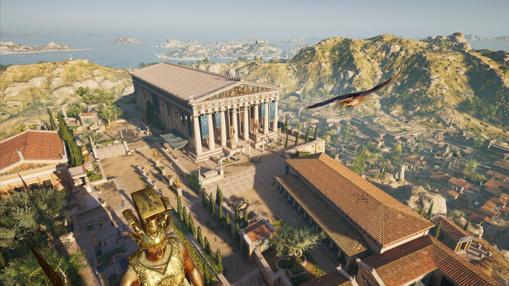
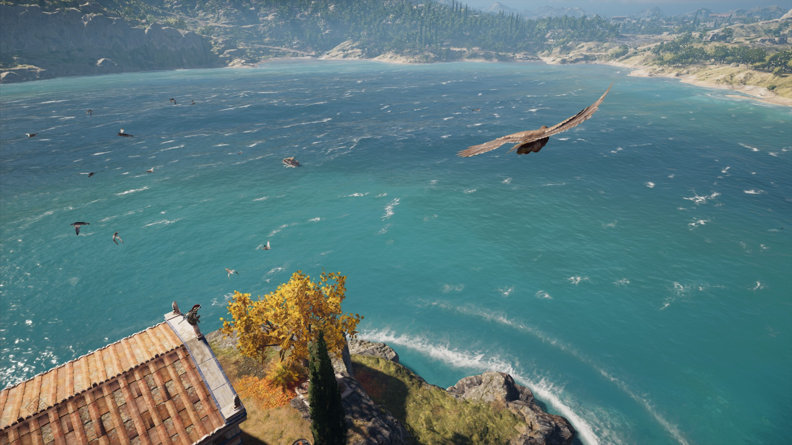
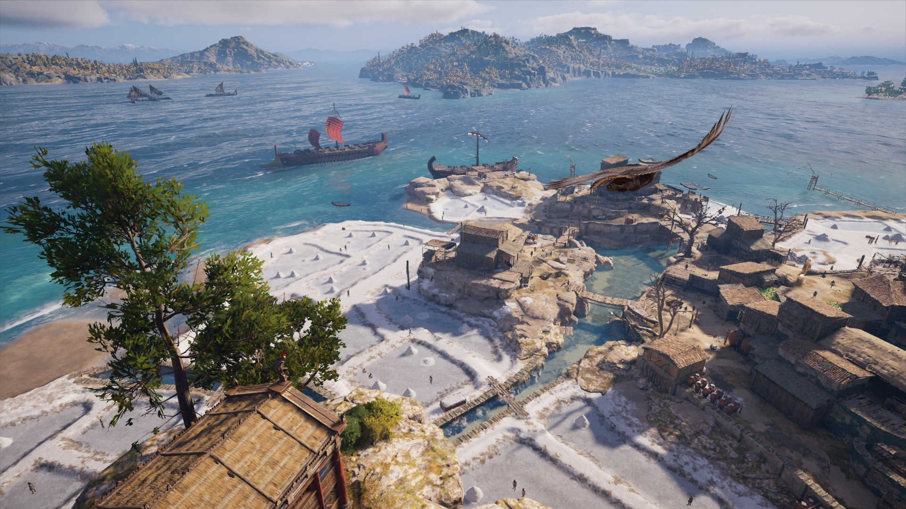

Hugo 主题 Stack 支持使用 Markdown 创建交互式图像库。它由 [PhotoSwipe](https://photoswipe.com/) 提供支持，其语法受到 [Typlog](https://typlog.com/) 的启发。

要使用此功能，图像必须与 Markdown 文件位于同一目录中，因为它使用 Hugo 的页面捆绑功能来读取图像的尺寸。**不支持外部图像**。

## 语法

```markdown
  
```

## 结果

  

> 图片来自于[《刺客信条：奥德赛》](https://store.steampowered.com/app/812140/Assassins_Creed_Odyssey/)游戏内截图